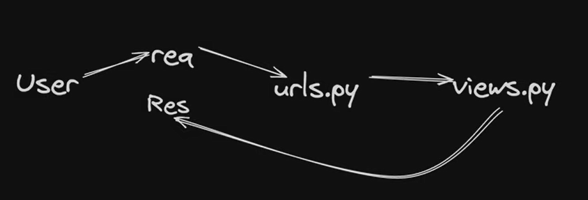

# Django Tutorial Chai Aur Django series
### Topics covered
- Starting Project , render html , load css files
    - create Project by
    ```django-admin startproject my_project```

    - server run by
    ```py manage.py runserver {port_no}```
    
    - Djagno server run this way:
        <!-- ! [alt text](./server.png) -->
        
    - create templates for rendering a html file will be inside templates folder
        - first add templates to the settings directory like this:
        ```python
        TEMPLATES = [
            {
                'BACKEND': 'django.template.backends.django.DjangoTemplates',
                'DIRS': ['templates'],
                'APP_DIRS': True,
                'OPTIONS': {
                    'context_processors': [
                        'django.template.context_processors.request',
                        'django.contrib.auth.context_processors.auth',
                        'django.contrib.messages.context_processors.messages',
                    ],
                },
            },
        ]

        ```
        - Here inside 'DIRS' add templates

    - To load static css with html file add `````` above html boilerpalte
    - link css like this ```<link rel="stylesheet" href=>```
    - to link static folder like html add this to the settings.py
    ```python
    STATIC_URL = 'static/'
    STATICFILES_DIRS = [os.path.join(BASE_DIR,'static')]
    ```
- creating an app
    - to create app 
    ```py manage.py startapp my_app```
    - add this app inside installed apps of settings.py file like this
    ```python
    INSTALLED_APPS = [
        'django.contrib.admin',
        'django.contrib.auth',
        'django.contrib.contenttypes',
        'django.contrib.sessions',
        'django.contrib.messages',
        'django.contrib.staticfiles',
        'ankesh',
    ]
    ```
    - here 'ankesh' is my created app name
    - create urls.py inside of the app also 
    - add urls.py inside the main projects urls.py as it would find it when required
    - add this urls.py of app in urls.py of project like this
    ```python
    urlpatterns = [
        path('admin/', admin.site.urls),
        path('',views.Home,name='home'),
        path('about/',views.About,name='about'),
        path('contact/',views.Contact,name='contact'),
        path('ankesh/',include('ankesh.urls'))
    ]
    ```
    - use include to do this
    ```from django.urls import path,include```
    - use static also same way have done already
- Layout or django engine
    - create a layout that can be use any of the app just by chnaging variable inside of that
    ```
        
        <!DOCTYPE html>
        <html lang="en">
        <head>
            <meta charset="UTF-8">
            <meta name="viewport" content="width=device-width, initial-scale=1.0">
            <title>
                
            </title>
            <link rel="stylesheet" href=>
        </head>
        <body>
            
                ** Here Content **
            
        </body>
        </html>
    ```
    - change like this 
    ```
        
        
            Ankesh and His App
        

        
            <h2>I am From ankesh App </h2>
        
    ```
    - here as I wanted to exxtend layout that why we need to add this line
    ``````
    - Here we can use jinja to do this
    - use block_unnamed emmet in python (for that install django extension)
    - use ```load``` emmet also get `````` and also this ```href=>```
